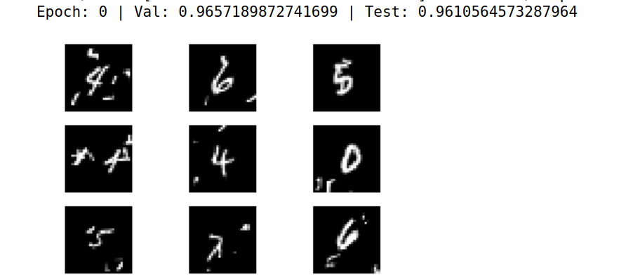

# SVHN_MNIST_STN
## 基于软注意力机制的STN模块在图像识别领域的应用研究


### STN模块如图
<br>
具体可以参考[deepmind团队的论文](http://www.arxiv.org/abs/1506.02025)


### 实验的模型和结构

<br>
&emsp;&emsp;&emsp;&emsp;&emsp;&emsp;&emsp;&emsp;<br>
<br>

### 实验的数据集
mnist(60x60x1)和[SVHN](http://ufldl.stanford.edu/housenumbers/)
<br>SVHN下载format1格式，如图


###实验的意外
在训练过程中意外发现，如果对数据集SVHN 进行训练，不加STN模块的网络训练结果会比加STN模块的网络的训练结果要好。

- 不带STN的CNN关于数据集svhn的训练结果
<br>
- 带STN的CNN关于数据集svhn的训练结果
<br>
- 原因
在SVHN数据集中有每张图片上每个数字的定位点，由于每张图片的尺寸不同，原始图片输入到神经网络时会自动根据每个数字的定位点提取出数字的图片，不需要STN
<br>&emsp;&emsp;&emsp;&emsp;&emsp;&emsp;&emsp;**数据集原图**  &emsp;&emsp;&emsp;&emsp;&emsp;&emsp;&emsp;&emsp;&emsp;&emsp;&emsp;&emsp;&emsp;&emsp;&emsp;&emsp;**输入到神经网络中**<br>
    &emsp;&emsp;&emsp;&emsp;&emsp;&emsp;&emsp;<br>
    &emsp;&emsp;&emsp;&emsp;&emsp;&emsp;&emsp;<br>
    &emsp;&emsp;&emsp;&emsp;&emsp;&emsp;&emsp;<br>


### 使用mnist进行STN测试

- 采用Mnist手写体数字数据集的变形，在原有基础上加入了噪声，并且图像像素为60*60，重新训练两个模型进行比对
<br><br>原图<br>&emsp;&emsp;&emsp;&emsp;&emsp;

- 0个epoch<br>
<br>&emsp;&emsp;&emsp;&emsp;&emsp;

- 10个epoch<br>
<br>&emsp;&emsp;&emsp;&emsp;&emsp;

- 20个epoch<br>
<br>&emsp;&emsp;&emsp;&emsp;&emsp;
- 对比图<br>
<br>&emsp;&emsp;&emsp;&emsp;&emsp;

- 训练结果<br>&emsp;&emsp;
<br>&emsp;&emsp;&emsp;&emsp;&emsp;&emsp;&emsp;
###### &emsp;&emsp;&emsp;&emsp;&emsp; &emsp;&emsp;&emsp;&emsp;&emsp; STN与非STN关于acc的变化，黄色的为STN,蓝色的为非STN

<br>&emsp;&emsp;
###### &emsp;&emsp;&emsp;&emsp;&emsp; &emsp;&emsp;&emsp;&emsp;&emsp; STN与非STN关于val_acc的变化，黄色的为STN,蓝色的为非STN


### 用法
```python
STN.py定义了4个网络
train_mnist.py,train_mnist_without_stn训练mnist
train_SVHN.py,train_SVHN_without_stn训练SVHN
```

### 总结
<br>&emsp;&emsp;
